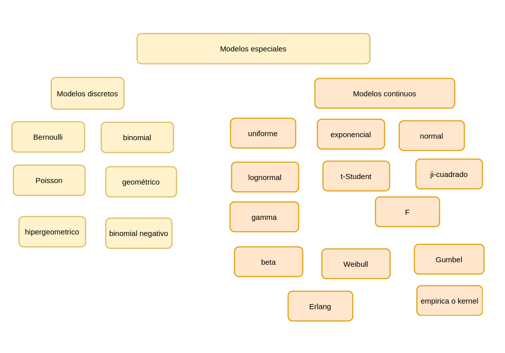

```{r setup, include=FALSE}
library(learnr)
knitr::opts_chunk$set(echo = FALSE,
                 exercise.warn_invisible = FALSE)
# colores
c1="#FF7F00" # NARANJA COLOR PRINCIPAL
c2="#034a94" # AZUL FUERTE COLOR SECUNDARIO  
c3="#0eb0c6" # AZUL CLARO COLOR TERCEARIO  
c4="#686868" # GRIS COLOR TEXTO 

```

</br>

## **PRESENTACIÓN**

```{r, echo=FALSE, out.width="100%", fig.align = "center"}
knitr::include_graphics("images/banner2.png")
```

El presente tutorial contiene preguntas relacionadas con , 
conceptos importantes en 

</br>
  
#### **CONCEPTOS**

Existe un grupo de modelos identificados para las variables aleatorias tanto discretas como continuas que son utilizadas con frecuencia en diferentes contextos. A continuación se relacionan los principales modelos:


#### **Modelos discretos**:

Bernoulli, binomial, Poisson, geometrico, hipergeometrico, binomial negativo.


#### **Modelos continuos**:

uniforme,  normal,  exponencial,  lognormal,  gamma,  beta,  Weibull,  Cauchy,  Gumbel,  t-Student,  Ji-cuadrado,  F de Fisher,  Empirica o  Kernel


En $R$ los nombre de las funciones diseñadas para los cálculos requeridos están conformadas por dos partes:

La primera parte es una letra que identifica el propósito de la función.


+ *d* : función de distribución de probabilidad $f(x)= P(X=x)$, para el caso discreto. En el caso de las variables continuas representa la función de densidad de probabilidad $f(x)$

+ *p* : función de probbilidad acumulada $F(x) = P(X \leq x)$

+ *q* : percentil $X_p$

+ *r* : generador de números aleatorios


La siguiene tabla presenta estas las funciones para los principales modelos tanto discretos como continuos

|*modelo*            |  $F(x)$  |  $X_{p}$ |  $f(x)$  | aleatorio   |
|:-------------------|:---------|:---------|:---------|:------------|
| modelos discretos  |          |          |          |             | 
|binomial            | pbinom   | qbinom   | dbinom   | rbinom      |
|gometrico           | pgeom    | qgeom    | dgeom    | rgeom       |       
|hipergeometrico     | phyper   | qhyper   | dhyper   | rhyper      |
|Poisson             | ppois    | qpois    | dpois    | rpois       |
|binomial negativo   | pnbinom  | qnbinom  | dnbionom | rnbinom     |
| modelos continuos  |          |          |          |             | 
|normal              | pnorm    | qnorm    | dnorm    | rmorm       |     
|beta                | pbeta    | qbeta    | dbeta    | rbeta       |
|Cauchy              | pcauchy  | qcauchy  | dcauchy  | rcauchy     |
|exponencial         | pexp     | qexp     | dexp     | rexp        |
|gamma               | pgamma   | qgamma   | dgamma   | rgamma      |
|lognormal           | plnorm   | qlnorm   | dlnorm   | rlnorm      |
|uniforme            | punif    | qunif    | dunif    | runif       |
|Weibull             | pweibull | qweibull | dweibull | rweibull    |
|t-Student           | pt       | qt       | dt       | rt          |
|Ji-cuadrado         | pchisq   | qchisq   | dchisq   | rchisq      |
|F                   | pf       | qf       | df       | rf          |

#### **Método de Montecarlo** 

Es un método no determinista o estadístico numérico, usado para aproximar expresiones matemáticas complejas y costosas de evaluar con exactitud. El método se llamó así en referencia al Casino de Montecarlo (Mónaco) por ser “la capital del juego de azar”, al ser la ruleta un generador simple de números aleatorios. El nombre y el desarrollo sistemático de los métodos de Montecarlo datan aproximadamente de 1944 y se mejoraron enormemente con el desarrollo de la computadora.  

El uso de los métodos de Montecarlo como herramienta de investigación, proviene del trabajo realizado en el desarrollo de la bomba atómica durante la Segunda Guerra Mundial en el Laboratorio Nacional de Los Álamos en EE. UU. Este trabajo conllevaba la simulación de problemas probabilísticos de hidrodinámica concernientes a la difusión de neutrones en el material de fisión. Esta difusión posee un comportamiento eminentemente aleatorio.	
(tomado de Wikipedia) 

</br>

#### **MAPA** 
  

```{r, echo=FALSE, , out.width="100%", fig.align = "center"}
  

```


## **PROBLEMAS**

### **Problema 1**

Para una variable aleatoria $X \sim unif(x,a,b)$,  con $a=10$ y  y $b=20$, simule una muestra de n=1000 y verifique que su  forma es aproximadamente constante en el rango de la variable 
 determine:

```{r p1, exercise=TRUE, exercise.lines = 15}
x=runif(1000,10,20)

```


```{r p1-hint}
library(dplyr)
x = runif(1000,10,20)
density(x) 

```


```{r p1-solution}
library(dplyr)
x = runif(1000,10,20)
density(x) %>% 
  plot(., main = "Distribución unif(10,20")
```


### **Problema 2**

Simule una variable $Z \sim N(0,1)$, y verifique mediante en gráfico de normalidad qqnorm que efectivamente su comportamiento es normal  

```{r p2, exercise=TRUE, exercise.lines = 15}
n=1000
z=rnorm(n,0,1)

```


```{r p2-hint}
n=1000
z=rnorm(n,0,1)
qqnorm()

```


```{r p2-solution}
n=1000
z=rnorm(n,0,1)
hist(z)
qqnorm(z)
qqline(z, col="red")

```


### **Problema 3**

Para una variables $X$ con distribución binomial con parámetros $n=50$ y $p=0.05$ y la variable $Y$,  media de una muestra de tamaño $n = 30$ de $X$, realice una grafica comparativa de las distribuciones  


```{r p3, exercise=TRUE, exercise.lines = 15}
n = 30
m = 1000
data=matrix(rbinom(n*m, 50,0.05), nrow = m)

```


```{r p3-hint}
n = 30
m = 1000
data=matrix(rbinom(n*m, 50,0.05), nrow = m)
x=data[,1]
y=apply(data, 1,mean)

```


```{r p3-solution}
n = 30
m = 1000
data=matrix(rbinom(n*m, 50,0.05), nrow = m)
x=data[,1]
y=apply(data, 1,mean)
par(mfrow = c(1, 2))
hist(x)
hist(y)
par(mfrow = c(1, 1))
```


### **Problema 5**

Simule una población de N=5000 objetos, donde cada objeto se clasifica en dos : en un 30% como $A$ y en el restante porcentaje como $B$. Verifique la proximidad del resultado a lo requerido


```{r p5, exercise=TRUE, exercise.lines = 15}
n=1000

```


```{r p5-hint}
n=1000
poblacion=sample(c("A", "B"),n,  ,  ))

```


```{r p5-solution}
n=1000
poblacion=sample(c("A", "B"),n,replace=TRUE, c(0.30,0.70))
tabla=prop.table(table(poblacion))
bplot=barplot(tabla)
text(bplot, tabla - 0.05, labels = tabla)
```


### **Problema 6**

Para una población simulada de tamaño $N=5000$ en la cual los individuos se pueden clasificar solo como : **M** (machos) o **H** (hembras) y cuya distribución es 50%-50% 


Genere una función que permita:
* Obtener una muestra aleatoria de la población y
* Calcule el estimador de la proporción muestral para un tamaño de muestra $n$ dado 


```{r p6, exercise=TRUE, exercise.lines = 15}
n=5000
poblacion=sample(c("M", "H"),n,replace=TRUE, c(0.50,0.50))
muestra=function()

```


```{r p6-hint}
n=5000
poblacion=sample(c("M", "H"),n,replace=TRUE, c(0.50,0.50))
muestra=function(poblacion, n){
             sample()  
}

```


```{r p6-solution}
n=5000
poblacion=sample(c("M", "H"),n,replace=TRUE, c(0.50,0.50))
muestra=function(poblacion, n){
             sample(poblacion, n, replace = TRUE)  
}

table(muestra(poblacion, 20))
```


### **Problema 7**
Victor distribuye partes para motocicletas, y se estima que cada una de ellas tiene una probabilidad de 0.03
 de estar defectuosa. José tambien distribuye partes semejantes y su producto tiene una probabilidad de 0.05
 de estar defectuoso. Usted recibe un envío de 100  partes procedente de cada vendedor (Victor y José).
 
Utilice una muestra simulada para estimar la probabilidad de que el número total de partes defectuosas sea menor a diez.
Construya una gráfica de probabilidad normal para el número total de partes defectuosas. ¿La cantidad sigue una distribución normal?

**Nota**

Suponga que:
* $X$ :número de partes defectuosas en el envío proveniente del almacén de Victor y 
* $Y$  del número de partes defectuosas provenientes del almacén de José

Además que las distribuciones de las variables $X$ y $Y$, son respectivamente :
* $X \sim binomial(100, 0.03)$ 
* $Y \sim binomial(100, 0.05)$
 

```{r p7, exercise=TRUE, exercise.lines = 15}
n=1000                     # número de replicas
x=rbinom(n, 100, 0.03)     # simulación de X 
y=rbinom(n, 100,0.05)      # simulación de Y


```


```{r p7-hint}
n=1000                     # número de replicas
x=rbinom(n, 100, 0.03)     # simulación de X 
y=rbinom(n, 100,0.05)      # simulación de Y
xy=data.frame(x,y)         # matriz de X y Y


```


```{r p7-solution}
n=1000                     # numero de simulaciones
x=rbinom(n, 100, 0.03)     # sumulacion de X
y=rbinom(n, 100,0.05)      # sumulacion de Y
xy=data.frame(x,y)         # matriz de X,Y
total = apply(xy,1, sum)   # construccion total

```


### **Problema 8**

Se fabrican placas rectangulares cuyas longitudes en pulgadas se distribuyen como $N(2.0; 0.01)$ y cuyos anchos se distribuyen $N(3.0; 0.04)$. Suponga que las longitudes y los anchos son independientes. El área de una placa esta dada por $A=XY$.


```{r, echo=FALSE, out.width="20%", fig.align = "center"}
knitr::include_graphics("images/lamina.png")
```

Utilice una muestra simulada de tamaño $1000$ para estimar la media y la varianza de $A$. Adicionalmente estime la probabilidad de que $P(5.9 <A<6.1)$.

**Nota**

$$\text{área} = \text{longitud} \times \text{ancho}$$

```{r p8, exercise=TRUE, exercise.lines = 15}
n=1000
x = rnorm(n, 2,0.1) # simulación de 1000 longitudes
y = rnorm(3, 0.2)   # simulación de 1000 anchos

```


```{r p8-hint}
n=1000
x = rnorm(n, 2,0.1) # simulación de 1000 longitudes
y = rnorm(n,3, 0.2)   # simulación de 1000 anchos
xy=data.frame(x,y)
A=apply(xy, 1,prod)

```


```{r p8-solution}
library(dplyr)

n=1000
x = rnorm(n, 2,0.1)   # simulación de 1000 longitudes
y = rnorm(n,3, 0.2)   # simulación de 1000 anchos
xy=data.frame(x,y)    # matriz X,Y 
A=apply(xy, 1,prod)   # contrucion área
cat("E[A]", mean(A), "\n")  # valor esperado
cat("V[A] = ", var(A))      # varianza

Prob=as.numeric(A>5.5 & A<6.5) %>%   # P( 5.5 < X < 6.5 )
   sum()/n  

cat("P(5.5 < X 6.5) = ",Prob)
```

