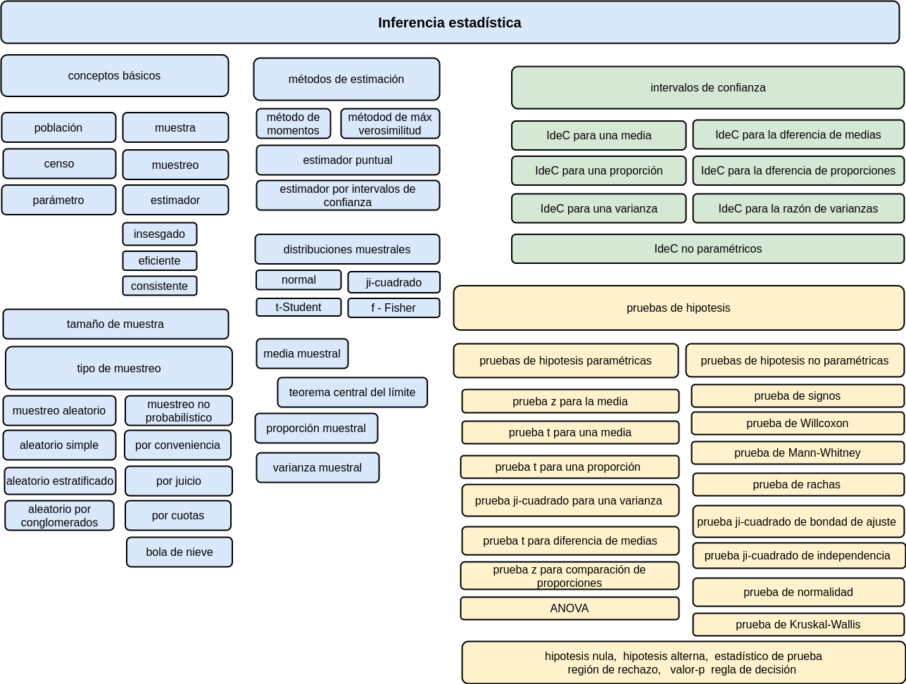
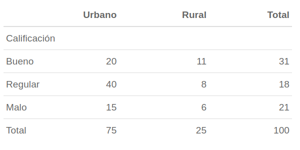

```{r setup, include=FALSE}
library(learnr)
knitr::opts_chunk$set(echo = FALSE,
                 exercise.warn_invisible = FALSE,
                 comment = NA)
# colores
c1="#FF7F00" # NARANJA COLOR PRINCIPAL
c2="#034a94" # AZUL FUERTE COLOR SECUNDARIO  
c3="#0eb0c6" # AZUL CLARO COLOR TERCEARIO  
c4="#686868" # GRIS COLOR TEXTO 
# library(normtest)
# library(nortest)
library(randtests)
```

## **PRESENTACIÓN**

```{r, echo=FALSE, out.width="100%", fig.align = "center"}
knitr::include_graphics("images/banner2.png")
```

El presente tutorial contiene preguntas relacionadas con , 
conceptos importantes en 

</br>
  
#### **CONCEPTOS**

##### **Población** 

<br/>

En Estadística, se identifica el término población con el dominio de la variable aleatoria X, asociada a los objetos o individuos sobre los cuales se desarrolla un experimento y cuyo valor ocurre al azar. El estudio del conjunto de todas las mediciones de interés para un investigador se llama CENSO (Mendenhall (2008)). Como ejemplo podemos mencionar la población de habitantes de Colombia que se estudia a través del Censo de población que se debe realizar cada diez años. 

<br/>

##### **Muestra** 

<br/>

Un subconjunto extraido de los elementos que conforman la población se denomina MUESTRA. Una definición técnica de muestra está dada por: repetición $n$ veces, en idénticas condiciones de la experiencia aleatoria, se puede obtener $n$ valores independientes de una variable aleatoria $X_{1}, X_{2},...,X_{n}$ a la que se le denomina muestra de la variable $X$.

<br/>

##### **Parámetro** 

<br/>

Es una caracterización numérica de la distribución de probabilidad de una variable aleatoria. Como ejemplo de parámetros tenemos a $\mu$, $\sigma^{2}$ que determinan la función de probabilidad de una variable con distribución normal: 


$$f(x)=\frac{1}{\sqrt{2 \sigma^{2} \pi}} \exp{\Bigg(- \frac{1}{2 \sigma^{2}}\big(x-\mu\big)^{2}\Bigg)}$$

Y  suponemos que los valores correspondientes a estos parámetros son $\mu=100$ y $\sigma^{2}=25$   ($\sigma=5$) respectivamente, entonces la función de distribución de probabilidad quedará determinada por :

$$f(x)=\frac{1}{\sqrt{50 \pi}} \exp{\Bigg(- \frac{1}{50}\big(x-100\big)^{2}\Bigg)}$$

<br/>

##### **Estimador** 

<br/>

Es una función de los valores obtenidos en una muestra aleatoria que da como resultado un valor que corresponde a una aproximación del parámetro objeto de estudio. Generalmente se representa como $\widehat{\theta}$. Como algunos ejemplos podemos citar:

$$\widehat{\mu}=\frac{1}{n}\sum_{i=1}^{n}x_{i}=\bar{x} $$
$$\widehat{\sigma^{2}}=\frac{1}{n-1}\sum_{i=1}^{n}\big(x_{i}-\bar{x}\big)^{2} = s^{2}$$

<br/><br/>

##### **Estimación** 

<br/>

Es la evaluación o generación del estimador para una muestra determinada. Como ejemplo podemos utilizar uno de los estimadores que estudiaremos :  $\widehat{\mu}= \bar{x}$, para una muestra dada:

$$ 630, 650, 710, 750, 790, 820, 860 \text{ y } 910$$

$$\widehat{\mu}=\frac{1}{n}\sum_{i=1}^{n} x_{i} =\frac{1}{8}(630+650+...+910)=765$$
El valor del estimador de $\mu$ para esta muestra es $$\widehat{\mu}=\bar{x}= 765$$.

<br/>

##### **Muestreo**

Selección de unidades de una población mediante un mecanismo que puede ser aleatorio o no aleatorio. con la función `sample()`, podemos seleccionar una muestra aleatoria de un conjunto de datos.

```{r}
sample(1:500, 10, replace = TRUE) # muestra de tamaño n=10 entre los números del 1 al 500, con repetición

```


</br>

##### **Propiedades de los estimadores**

* **Insesgadez** : El valor esperado del estimador es igual al parámetro (La media de muchas medias obtenidas de muestras estan proximas al parámetro) $E[\widehat{\theta}] = \theta$
* **Eficiencia** : El estimador eficiente es el que tiene la menor varianza
* **Consistencia** : Es el estimador que siendo sesgado, se convierte en insesgado cuando se aumenta el tamaño de la muestra.

Es deseable que los estimadores que utilicemos sean insesgados y eficientes.


##### **Intervalos de confianza**

Un estimador por intervalo de confianza ($IC$) es una regla que especifica como usar las mediciones obtenidas en una muestra para calcular dos números que forman los extremos del intervalo que confiamos contenga al parámetro de interés $\theta$

Dependiendo del parámetro se utiliza en la construcción del $IC$ las distribuciones muestrales: 

* normal estándar
* t−Student
* chi-cuadrado
* F−Fisher 


##### **Pruebas de hipótesis**

Procedimiento que permite concluir a cerca de una afirmación sobre un parámetro de interés. Existen pruebas paramétricas y no paramétricas. 

Desde el punto de vista clásico, todas las pruebas de hipótesis trabajan en base a ciertos principios que consideran:

* Hipótesis nula ($H_0$)

* Hipótesis alterna ($H_1$)

* Estadístico de Prueba ($EdeP$)

* Región de Rechazo ($RdeR$)

* Regla de Decisión($RD$)


Cuando se decide ya sea en favor o en contra de una determinada prueba de hipótesis, es posible estar en una de las cuatro situaciones:

* Rechazar $H_0$, siendo que en la realidad $H_0$ es verdadera. Error tipo I (Falsos positivos). $P(\text{Error tipo I} ) = \alpha$
* No rechazar $H_0$, siendo que en la realidad $H_0$, es falsa. Error tipo II (Falsos negativos). $P(\text{Error tipo II} ) = \\beta$
* Rechazar $H_0$, cuando en realidad $H_0$ es falsa. Decisión correcta . Potencia de la prueba. . $P(\text{Dec.Corecta} ) = 1-\beta$
* No rechazar $H_0$, cuando en realidad $H_0$ es verdadera. Decisión correcta.


</br>

#### **MAPA** 
  

```{r, echo=FALSE, , out.width="100%", fig.align = "center"}
  

```

## **CUESTIONARIO**

### **Pregunta 1**

```{r quiz_1}

quiz(
  question("¿La muestra es un subconjunto de la población que..", 
           correct = "Respuesta y explicación!, .", 
           allow_retry = TRUE,
           answer("Es necesaria tener para hacer estadística", message = "Cerca, pero no...intentalo de nuevo!"),
           answer("Es lo más representativo de la población", message = "Nop...intentalo de nuevo!"),
           answer("Es un subconjunto extraido al azar de la población", message = "Incorrecto. Intenta de nuevo!."),
           answer("Es seleccionada para estimar un parámetro de interés de la población 4", correct = TRUE),
           # Si no cambiamos estos textos en los botones, se mostrarán en Inglés  
           submit_button = "Enviar respuesta",
           try_again_button = "Intentar de nuevo"),
  # Si no ponemos un caption aparecerá la palabra Quiz en inglés.
  caption = " "
)

```


### **Pregunta 2**

```{r quiz_2}

quiz(
  question("El tamaño de muestra", 
           correct = "Respuesta y explicación!, .", 
           allow_retry = TRUE,
           answer("Es proporcional al tamaño de la población 1", message = "Cerca, pero no...intentalo de nuevo!"),
           answer("Es el 5% del tamaño de la población", message = "Nop...intentalo de nuevo!"),
           answer("Se calcula sobre la base de la estratificación", message = "Incorrecto. Intenta de nuevo!."),
           answer("Depende de la dispersión de la población", correct = TRUE),
           # Si no cambiamos estos textos en los botones, se mostrarán en Inglés  
           submit_button = "Enviar respuesta",
           try_again_button = "Intentar de nuevo"),
  # Si no ponemos un caption aparecerá la palabra Quiz en inglés.
  caption = "  "
)

```


### **Pregunta 3**

Un intervalo de confianza para una muestra de 100 de los tiempos  empleados por los athletas que participaron en la carrela La Luz 2022 del 95% de confianza es : $(64.69368; \hspace{.2cm} 65.83180)$. 


```{r quiz_3}

quiz(
  question("Este resultado se puede interpretar como:", 
           correct = "Respuesta y explicación!, .", 
           allow_retry = TRUE,
           answer("El 95% de los atletas emplearon entre 64.7 y 68.8 minutos", message = "No,...intentalo de nuevo!"),
           answer("Existe una probabilidad del 95%  que un atleta gaste entre 64.7 y 68.8 minutos en una carrera similar", message = "No...intentalo de nuevo!"),
           answer("Si se repite el muestreo el 95% de los intervalos (64.69368 ; 65.83180)  construidos contendrám la media", message = "Incorrecto. Intenta de nuevo!."),
           answer(" ", correct = TRUE),
           # Si no cambiamos estos textos en los botones, se mostrarán en Inglés  
           submit_button = "Enviar respuesta",
           try_again_button = "Intentar de nuevo"),
  # Si no ponemos un caption aparecerá la palabra Quiz en inglés.
  caption = "  "
)

```

### **Pregunta 4**

```{r quiz_4}

quiz(
  question("¿Pregunta?", 
           correct = "Respuesta y explicación!, .", 
           allow_retry = TRUE,
           answer("opción 1", message = "Cerca, pero no...intentalo de nuevo!"),
           answer("opción 2", message = "Nop...intentalo de nuevo!"),
           answer("opción 3", message = "Incorrecto. Intenta de nuevo!."),
           answer("opción 4", correct = TRUE),
           # Si no cambiamos estos textos en los botones, se mostrarán en Inglés  
           submit_button = "Enviar respuesta",
           try_again_button = "Intentar de nuevo"),
  # Si no ponemos un caption aparecerá la palabra Quiz en inglés.
  caption = " "
)

```


### **Pregunta 5**

```{r quiz_5}

quiz(
  question("En el muestreo", 
           correct = "Respuesta y explicación!, .", 
           allow_retry = TRUE,
           answer("No debe haber error", message = "No...intentalo de nuevo!"),
           answer("Es importante conseguir un tamaño de muestra grande", message = "Nop...intentalo de nuevo!"),
           answer("Se calculael tamaño óptimo para un determinado nivel de error", correct = TRUE),
           answer("El error no debe superar el 3%", message = "Incorrecto. Intenta de nuevo!."),
           # Si no cambiamos estos textos en los botones, se mostrarán en Inglés  
           submit_button = "Enviar respuesta",
           try_again_button = "Intentar de nuevo"),
  # Si no ponemos un caption aparecerá la palabra Quiz en inglés.
  caption = " "
)

```


### **Pregunta 6**

```{r quiz_6}

quiz(
  question("El nivel de significación o de significancia es la probabilidad de:", 
           correct = "El nivel de significancia o alpha es la probabilidad de cometer error tipo I", 
           allow_retry = TRUE,
           answer("Rechazar Ho, cuando Ho  es falsa", message = "Cerca, pero no...intentalo de nuevo!"),
           answer("Rechazar Ho, cuando Ho es verdadera", correct = TRUE),
           answer("No rechazar Ho, cuando Ho es falsa", message = "Incorrecto. Intenta de nuevo!."),
           answer("No rechazar Ho, cuando Ho es verdadera", message = "Nop...intentalo de nuevo!"),
           # Si no cambiamos estos textos en los botones, se mostrarán en Inglés  
           submit_button = "Enviar respuesta",
           try_again_button = "Intentar de nuevo"),
  # Si no ponemos un caption aparecerá la palabra Quiz en inglés.
  caption = "  "
)

```


### **Pregunta 7**

```{r quiz_7}

quiz(
  question("Respecto a las pruebas de hipótesis, cuál de las siguientes afirmaciones es falsa:", 
           correct = "La significancia es un referene que nos permite el rechazo o no de una prueba de hipótesis", 
           allow_retry = TRUE,
           answer("Es un procedimiento por el cual nos decidimos por la hipótesis nula (Ho) o por la alternativa (Ha).", message = "Cerca, pero no...intentalo de nuevo!"),
           answer("La Ha es la que se pone a prueba al realizar una prueba estadística.", message = "Nop...intentalo de nuevo!"),
           answer("La Ha es al que se aceptará si el resultado de la prueba permite rechazar la Ho.", message = "Incorrecto. Intenta de nuevo!."),
           answer("La significancia estadística es la condición resultante del rechazo de la Ho.", correct = TRUE),
           # Si no cambiamos estos textos en los botones, se mostrarán en Inglés  
           submit_button = "Enviar respuesta",
           try_again_button = "Intentar de nuevo"),
  # Si no ponemos un caption aparecerá la palabra Quiz en inglés.
  caption = "  "
)

```


### **Pregunta 8**

```{r quiz_9}

quiz(
  question("Es una prueba de hipótesis no paramétrica", 
           correct = "la prueba de Shapiro-Wilk, es una prueba de normalidad, no paramétrica ", 
           allow_retry = TRUE,
           answer("prueba t para comparación de medias", message = "No...intentalo de nuevo!"),
           answer("prueba F para la comparación de varianzas", message = "Nop...intentalo de nuevo!"),
           answer("prueba z para una media", message = "Incorrecto. Intenta de nuevo!."),
           answer("prueba de Shapiro- Wilk", correct = TRUE),
           # Si no cambiamos estos textos en los botones, se mostrarán en Inglés  
           submit_button = "Enviar respuesta",
           try_again_button = "Intentar de nuevo"),
  # Si no ponemos un caption aparecerá la palabra Quiz en inglés.
  caption = "  "
)

```


## **PROBLEMAS**


### **Problema 1**

La siguiente información corresponde a la calificación obtenida por un grupo de estudiantes en una prueba de inglés. 

4.1, 2.7, 3.1, 3.2, 3.0, 3.2, 2.0, 2.4, 1.6, 3.2, 3.1, 2.6, 2.0, 2.4, 2.8, 3.3, 4.0, 3.4, 3.0, 3.1, 2.7, 2.7, 3.0, 3.8, 3.2, 2.2, 3.5, 3.5, 3.8, 3.5, 3.9, 4.2, 4.3, 3.9, 3.2, 3.5, 3.5, 3.7, 4.1, 3.7, 3.5, 3.6, 3.2, 3.1, 3.4, 3.0, 3.0, 3.0, 2.7, 1.7, 3.6, 2.1, 2.4, 3.0, 3.1, 2.5, 2.5, 3.6, 2.2, 2.4, 3.1, 3.3, 2.7, 3.7, 3.0, 2.7, 3.0, 3.2, 3.1, 2.4, 3.0, 2.7, 2.5, 3.0, 3.0, 3.0, 3.2, 3.1, 3.8, 4.1, 3.7, 3.5, 3.0, 3.7, 3.7, 4.1, 3.7, 3.9, 3.7, 2.0

Se requiere determinar si los resultados siguen una distribución normal.

```{r p1, exercise=TRUE, exercise.lines = 15}


```


```{r p1-hint}
nota=c(4.1, 2.7, 3.1, 3.2, 3.0, 3.2, 2.0, 2.4, 1.6, 3.2, 3.1, 2.6, 2.0, 2.4, 2.8, 3.3, 4.0, 3.4, 3.0, 3.1, 2.7, 2.7, 3.0, 3.8, 3.2, 2.2, 3.5, 3.5, 3.8, 3.5, 3.9, 4.2, 4.3, 3.9, 3.2, 3.5, 3.5, 3.7, 4.1, 3.7, 3.5, 3.6, 3.2, 3.1, 3.4, 3.0, 3.0, 3.0, 2.7, 1.7, 3.6, 2.1, 2.4, 3.0, 3.1, 2.5, 2.5, 3.6, 2.2, 2.4, 3.1, 3.3, 2.7, 3.7, 3.0, 2.7, 3.0, 3.2, 3.1, 2.4, 3.0, 2.7, 2.5, 3.0, 3.0, 3.0, 3.2, 3.1, 3.8, 4.1, 3.7, 3.5, 3.0, 3.7, 3.7, 4.1, 3.7, 3.9, 3.7, 2.0)
shapiro.test()

```


```{r p1-solution}
nota=c(4.1, 2.7, 3.1, 3.2, 3.0, 3.2, 2.0, 2.4, 1.6, 3.2, 3.1, 2.6, 2.0, 2.4, 2.8, 3.3, 4.0, 3.4, 3.0, 3.1, 2.7, 2.7, 3.0, 3.8, 3.2, 2.2, 3.5, 3.5, 3.8, 3.5, 3.9, 4.2, 4.3, 3.9, 3.2, 3.5, 3.5, 3.7, 4.1, 3.7, 3.5, 3.6, 3.2, 3.1, 3.4, 3.0, 3.0, 3.0, 2.7, 1.7, 3.6, 2.1, 2.4, 3.0, 3.1, 2.5, 2.5, 3.6, 2.2, 2.4, 3.1, 3.3, 2.7, 3.7, 3.0, 2.7, 3.0, 3.2, 3.1, 2.4, 3.0, 2.7, 2.5, 3.0, 3.0, 3.0, 3.2, 3.1, 3.8, 4.1, 3.7, 3.5, 3.0, 3.7, 3.7, 4.1, 3.7, 3.9, 3.7, 2.0)

shapiro.test(nota)
```


### **Problema 2**

Un investigador desea establecer la relación que puede existir entre la calificación obtenida por un producto por parte de sus consumidores y su ubicación de residencia. Con este fin recoge información de 100 de sus clientes:


```{r, echo=FALSE, , out.width="70%", fig.align = "center"}
  

```


```{r p2, exercise=TRUE, exercise.lines = 15}
m=c(20,40,15,11,8,6)
m=as.table(matrix(m,nrow=3))
rownames(m)=c("Bueno", "Regular", "Malo")
colnames(m)=c("Urbano", "Rural")
m

```


```{r p2-hint}
m=c(20,40,15,11,8,6)
m=as.table(matrix(m,nrow=3))
rownames(m)=c("Bueno", "Regular", "Malo")
colnames(m)=c("Urbano", "Rural")
chisq.test()

```


```{r p2-solution}
m=c(20,40,15,11,8,6)
m=as.table(matrix(m,nrow=3))
rownames(m)=c("Bueno", "Regular", "Malo")
colnames(m)=c("Urbano", "Rural")
chisq.test(m)
```


### **Problema 3**

Una encuesta realizada a 100 usuarios de una tarjeta de crédito seleccionados aleatoriamente, 57 dijeron que sabían que empleando su tarjeta podían ganar millas de viajero. Después de una campaña publicitaria para difundir este beneficio, se realizo una encuesta independiente entre 150 usuarios de la tarjeta de crédito y 87 informaron que conocían el beneficio. ¿Se puede concluir que el conocimiento de este beneficio aumento después de la campaña publicitaria? 

```{r p3, exercise=TRUE, exercise.lines = 15}


```


```{r p3-hint}
prop.test()

```


```{r p3-solution}
prop.test(c(57,87),c(100,150),p = NULL,alternative = "less",conf.level = 0.95)
```


### **Problema 4**

Una empresa desarrolla un curso de entrenamiento para sus empleados, formando dos grupos y aplicando dos metodologías diferentes de entrenamiento con el fin de poder evaluar que método produce los mejores resultados. El primer grupo (g1) esta conformado por 36 empleados y el segundo grupo (g2) por 40 empleados . Se puede afirmar que el método aplicado al segundo grupo produce mejores resultados que el aplicado al primer grupo ? 

```{r p4, exercise=TRUE, exercise.lines = 15}
grupo1=c(6.8, 6.1, 5.8, 5.9, 5.8, 6.4, 5.7, 6.0, 5.9, 6.4, 6.0, 5.7, 6.5, 6.5, 6.0, 5.9, 5.7, 5.8, 5.9, 5.8, 6.0, 6.0, 5.8, 5.7, 6.1, 5.9, 5.2, 6.3, 5.4, 6.5, 5.5, 5.9, 7.0, 6.4, 5.1, 6.3)
grupo2=c(8.8, 8.5, 8.4, 8.5, 7.6, 8.7, 8.0, 7.9, 8.2, 8.0, 7.8, 8.6, 8.5, 7.9, 8.5, 8.3, 8.4, 8.2, 8.3, 7.9, 8.2, 7.7, 7.8, 7.7, 8.1, 8.0, 8.3, 8.2, 8.1, 8.3, 8.1, 8.8, 7.7, 9.1, 7.6, 8.4, 8.2, 8.3, 8.1, 8.7)

```


```{r p4-hint}
grupo1=c(6.8, 6.1, 5.8, 5.9, 5.8, 6.4, 5.7, 6.0, 5.9, 6.4, 6.0, 5.7, 6.5, 6.5, 6.0, 5.9, 5.7, 5.8, 5.9, 5.8, 6.0, 6.0, 5.8, 5.7, 6.1, 5.9, 5.2, 6.3, 5.4, 6.5, 5.5, 5.9, 7.0, 6.4, 5.1, 6.3)
grupo2=c(8.8, 8.5, 8.4, 8.5, 7.6, 8.7, 8.0, 7.9, 8.2, 8.0, 7.8, 8.6, 8.5, 7.9, 8.5, 8.3, 8.4, 8.2, 8.3, 7.9, 8.2, 7.7, 7.8, 7.7, 8.1, 8.0, 8.3, 8.2, 8.1, 8.3, 8.1, 8.8, 7.7, 9.1, 7.6, 8.4, 8.2, 8.3, 8.1, 8.7)
var.test(grupo1,grupo2)

```


```{r p4-solution}
grupo1=c(6.8, 6.1, 5.8, 5.9, 5.8, 6.4, 5.7, 6.0, 5.9, 6.4, 6.0, 5.7, 6.5, 6.5, 6.0, 5.9, 5.7, 5.8, 5.9, 5.8, 6.0, 6.0, 5.8, 5.7, 6.1, 5.9, 5.2, 6.3, 5.4, 6.5, 5.5, 5.9, 7.0, 6.4, 5.1, 6.3)
grupo2=c(8.8, 8.5, 8.4, 8.5, 7.6, 8.7, 8.0, 7.9, 8.2, 8.0, 7.8, 8.6, 8.5, 7.9, 8.5, 8.3, 8.4, 8.2, 8.3, 7.9, 8.2, 7.7, 7.8, 7.7, 8.1, 8.0, 8.3, 8.2, 8.1, 8.3, 8.1, 8.8, 7.7, 9.1, 7.6, 8.4, 8.2, 8.3, 8.1, 8.7)

var.test(grupo1,grupo2)
t.test(grupo1, grupo2,alternative ="less", mu = 0, paired = FALSE, var.equal = TRUE, conf.level = 0.95)
```


### **Problema 5**

Para un conjunto de datos generados de manera aleatoria, realice tres pruebas que permitan verificar que tienen una distribución normal


```{r p5, exercise=TRUE, exercise.lines = 15}
x=rnorm(200,1000,50)

```


```{r p5-hint}
x=rnorm(200,1000,50)
shapiro.test(x)
# install.packages("normtets")
# library(normtest) # paquete de pruebas de normalidad
# jb.norm.test(x)  # Test de normalidad de Jarque-Bera
# kurtosis.norm.test(x) # Test de curtosis normal
# skewness.norm.test(x)  # test de sesgo normal

# install.packages("nortets")
# library(nortest)
# lillie.test(x)  # test de Kolmogorof-Smirnov
```


```{r p5-solution}

```


### **Problema 6**

Se desea extraer una muestra aleatoria del grupo de participantes y probar que es aleatoria con respecto al sexo.

$H_0 : X$ es una variable aleatoria
$H_1 : X$ es una variable aleatoria


```{r p6, exercise=TRUE, exercise.lines = 15}
library(paqueteMETODOS)
library(randtests)
data("CarreraLuz22")
```


```{r p6-hint}
library(paqueteMETODOS)
library(randtests)
data("CarreraLuz22")
x=sample(CarreraLuz22$sex, 100)
rachas<-as.numeric(x=="Hombre")

```


```{r p6-solution}
library(paqueteMETODOS)
library(randtests)
data("CarreraLuz22")
x=sample(CarreraLuz22$sex, 100)
rachas<-as.numeric(x=="Hombre")
runs.test(rachas,alternative = "left.sided",threshold = 0.5,pvalue = "exact",plot=F)
```


